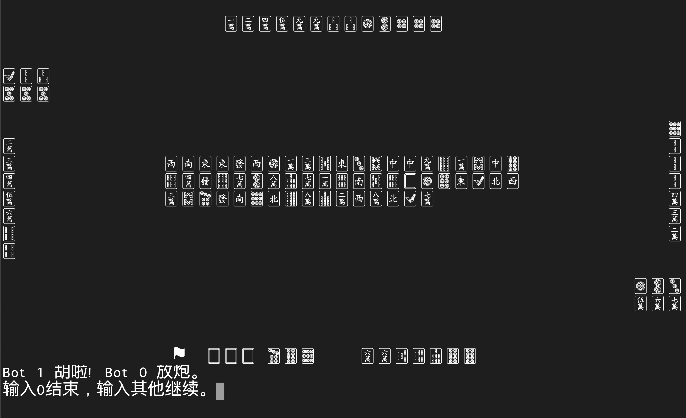
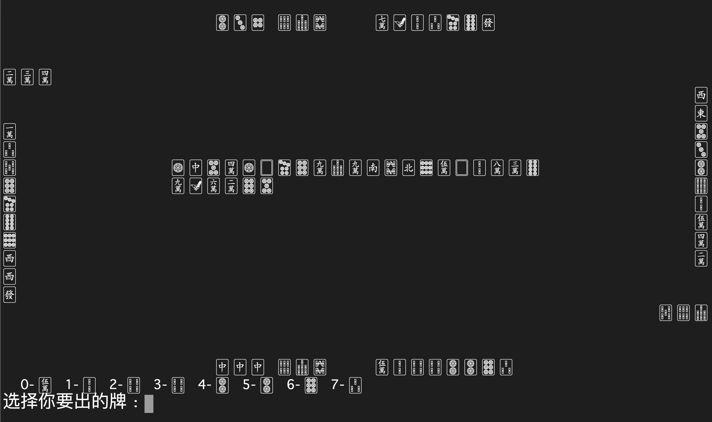
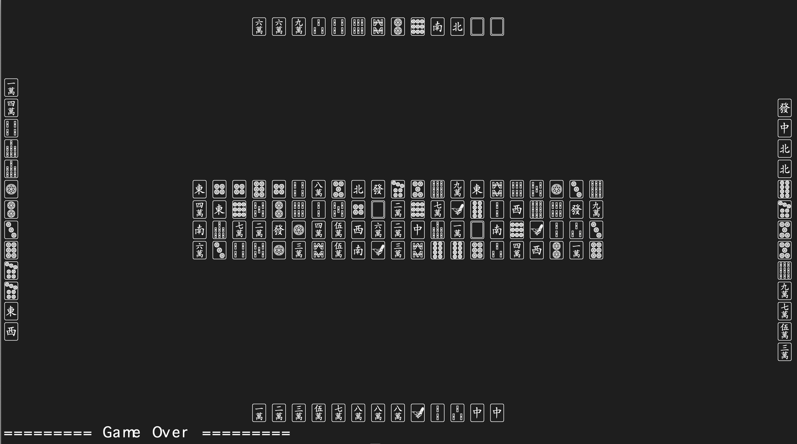

# Terminal Mahjong

## 2020.04.03

- 自己摸到杠时候现在能主动杠了，也可以加杠了。
- 增加了听牌指示，会在左边出现一面小旗 ⚑ 。
- 优化了 Player 类的结构，优化了 AI ，现在 AI 们也能胡了🌚。
- 增加了输入检测，乱输不会中断程序了。

有一说一，如果看不到 AI 牌了可能就真的有那么点回事了🌝。

TODO:

- 盖牌输出（就是懒）
- 抢杠，特殊胡牌等特殊规则
- 算番
- 优化 AI

---

## 2020.04.02

- 增加了杠吃碰的规则，重新排列了杠碰吃之后的牌堆。
- 增加了 Bot 类，现在的 Bot 都是憨憨，无脑杠吃碰，所以现在的 AI 唯一策略就是大吊车策略🌚？想起来胡的概率应该比之前要高了不少，反正我是没碰到过🌚。
- 增加了一些交互，可以定义 Player 的名字，一局结束后会选择是否继续开局。

反正现在看起来是怎么个意思了🌝。

TODO:

- 盖牌输出
- 听牌检测
- 主动杠，抢杠，加杠
- 算番
- 一些特殊胡牌牌型的检测，十三幺、七对等🤦🏻
- Bot 的 AI 强化 🤦🏻

---

## 2020.04.01

这是一款在 Terminal 玩的麻将游戏，我逛 Unicode-Table 的时候发现了这一套麻将的字符，于是无聊写了一个纯字符的麻将，现在的版本只能自摸和点炮，吃碰杠还没做🤦🏻，算番也没做。

> 🀀 🀁 🀂 🀃 🀄 🀅 🀆 
> 🀇 🀈 🀉 🀊 🀋 🀌 🀍 🀎 🀏 
> 🀐 🀑 🀒 🀓 🀔 🀕 🀖 🀗 🀘 
> 🀙 🀚 🀛 🀜 🀝 🀞 🀟 🀠 🀡 
> 🀢 🀣 🀤 🀥 🀦 🀧 🀨 🀩 🀪 
> 🀫

macOS 好像会自动把🀄️变成 emoji ，建议把 Terminal 的描述文件字体设置为 Apple Symbols 40 点，字符间距改为 0.75，在 Terminal 里运行 Game.py 启动，运行效果如下。

而且，他们都是明牌打的🌚，等我有空了把剩下的坑补上🤦🏻。